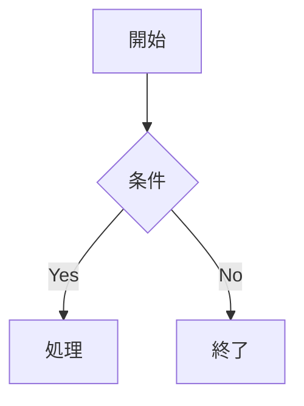

# Ageha Editor


> このアプリケーションを使用したことで発生した、いかなる損害も、作者は保証しません。
>
> 特に macOS について、作者は「ヨドバシカメラでしか MacBook は触れたことがない」と言っています。さらに「Linux で動いたから動くでしょ」と言っています。

## アプリケーション概要

**Ageha Editor**は [Tauri](https://v2.tauri.app/ja/) 製のマークダウンエディター。軽量かつインストール不要で使用可能。


### 基本機能

- リアルタイムプレビュー
- 印刷機能（PDF出力を含む）
- HTML エクスポート
- 入力支援機能
- フローチャート対応（Mermaid）
- 数式対応（KaTeX）
- スライド作成機能（Marp）
- スライドショー機能
- Vim モード
- カスタム CSS

---

## 機能詳細

### エディタ

- [Ace Editor](https://ace.c9.io/) ベースの高機能テキストエディタ
- **Vim モード**: Vim キーバインドへ切り替え可能（`Ctrl+,` または UI トグルボタン）
- **スクロール同期**: エディタとプレビューのスクロール位置を連動
- **未保存状態の追跡**: タイトルバーに `*` を表示

### ファイル操作

| 操作               | 説明                                         |
| ------------------ | -------------------------------------------- |
| ファイルを開く     | ダイアログでファイルを選択して読み込み       |
| ファイルを保存     | 現在の内容をローカルファイルへ保存           |
| ドラッグ＆ドロップ | ファイルをエディタ領域にドロップして読み込み |
| 新規ウィンドウ     | 新しいエディタウィンドウを起動               |

対応ファイル形式: `.md` `.txt`

### 出力

- **印刷 / PDF出力**: ブラウザの印刷機能を利用してPDFに出力
- **HTML エクスポート**: CSS・画像・フォントをインライン化した単一ファイルの HTML を出力
- **別ウィンドウビューア**: プレビューを独立したウィンドウで表示

### マークダウン拡張記法

標準の Markdown に加えて、以下の独自記法に対応。

| 記法                       | 説明               |
| -------------------------- | ------------------ |
| `?[alt](video.mp4)`        | 動画埋め込み       |
| `@[youtube](URL)`          | YouTube 埋め込み   |
| `:::details 見出し...:::`  | 折りたたみブロック |
| `:::note 見出し...:::`     | ノートブロック     |
| `:::warning　見出し...:::` | 警告ブロック       |
| `@@@`                      | 改ページ（印刷時） |

### スライドモード


frontmatter に `marp: true` を記述すると自動的にスライドモードへ切り替わる。

```markdown
---
marp: true
---

# スライドタイトル

---

## 2枚目のスライド
```

- テーマ `ageha-slide`、サイズ `16:9`、数式 `KaTeX` を自動設定
- 印刷・HTML エクスポート・ビューア表示に対応

#### スライドショー（`Ctrl+Alt+S` または "Play" ボタン）


スライドモード時のみ有効。1 枚ずつ表示する発表モードのウィンドウを開く。

| 操作 | 動作 |
|------|------|
| `→` / `↓` / `Space` | 次のスライド |
| `←` / `↑` | 前のスライド |
| `Home` / `End` | 最初 / 最後のスライド |
| 画面右半分クリック | 次のスライド |
| 画面左半分クリック | 前のスライド |
| 画面下部ホバー | ナビゲーション UI（← カウンター →）を表示 |

### Mermaid ダイアグラム

コードブロックに `mermaid` を指定するとダイアグラムをレンダリング。

````markdown

````

フローチャート、シーケンス図、状態遷移図、クラス図、ER図などに対応。

> プレビューへの反映は `Ctrl + m`

### 数式（KaTeX）

インライン数式とディスプレイ数式に対応。

```
インライン: $E = mc^2$

ディスプレイ:
$$
消費税額 = \frac{税込み価格 × 消費税率}{消費税率 + 100}
$$
```

---

## キーボードショートカット

| キー         | 機能                           |
| ------------ | ------------------------------ |
| `Ctrl+O`     | ファイルを開く                 |
| `Ctrl+S`     | ファイルを保存                 |
| `Ctrl+R`     | 画像を挿入                     |
| `Ctrl+M`     | Mermaid を再描画               |
| `Ctrl+,`     | Vim モードの切り替え           |
| `Ctrl+Alt+P` | 印刷 / PDF出力                 |
| `Ctrl+Alt+F` | HTML エクスポート              |
| `Ctrl+Alt+W` | 別ウィンドウでプレビューを表示 |
| `Ctrl+Alt+/` | プレビューの表示 / 非表示      |
| `Ctrl+Alt+I` | 入力支援パネルの表示 / 非表示  |
| `Ctrl+Alt+H` | ヘルプを表示                   |
| `Ctrl+Alt+N` | 新規ウィンドウを開く           |
| `Ctrl+Alt+S` | スライドショーを開く           |
| `Escape`     | モーダルを閉じる               |

---

## カスタム CSS

初回起動時にユーザーディレクトリへ `~/.ageha/` が作成される。

| ファイル                   | 説明                             |
| -------------------------- | -------------------------------- |
| `~/.ageha/ageha.css`       | マークダウンプレビューのスタイル |
| `~/.ageha/ageha-slide.css` | スライドプレビューのスタイル     |

これらのファイルを編集することでプレビュー・印刷・HTML エクスポートのスタイルをカスタマイズできる。

---

## 開発

### 必要環境

- Node.js 18+
- Rust 1.70+
- Tauri CLI v2

### セットアップと実行

```bash
npm install
npm run tauri dev
```

### ビルド

```bash
npm run build
npm run tauri build
```

### リリース

リリースは GitHub Actions の `release.yml` ワークフローで行う。Linux / macOS (Universal) / Windows のインストーラーを自動ビルドし、ドラフトリリースとして GitHub にアップロードする。

#### テスト手順（本番実行前の確認）

仮タグを push してワークフローが正常に動作するか確認する。

```bash
# 1. テスト用ブランチを作成
git checkout -b test/release-workflow

# 2. 仮タグを push（ワークフローがトリガーされる）
git tag v0.0.0-test
git push origin v0.0.0-test
```

GitHub の **Actions** タブで進捗を確認する。`gh` CLI を使う場合:

```bash
gh run list --workflow=release.yml
gh run watch
```

確認後、仮タグとドラフトリリースを削除してクリーンアップする。

```bash
# ローカルとリモートのタグを削除
git tag -d v0.0.0-test
git push origin --delete v0.0.0-test
```

GitHub UI で **Releases → ドラフト → Delete** からドラフトリリースも削除する。

#### 本番リリース手順

```bash
# 1. バージョンを更新（package.json / src-tauri/Cargo.toml / src-tauri/tauri.conf.json）

# 2. コミット
git add package.json src-tauri/Cargo.toml src-tauri/tauri.conf.json
git commit -m "Prepare for release vX.Y.Z"

# 3. タグを付けて push（ワークフローがトリガーされる）
git tag vX.Y.Z
git push origin main --tags
```

ワークフロー完了後、GitHub の **Releases** にドラフトリリースが作成されるので、内容を確認して **Publish release** で公開する。

---

## ライセンス

MIT
