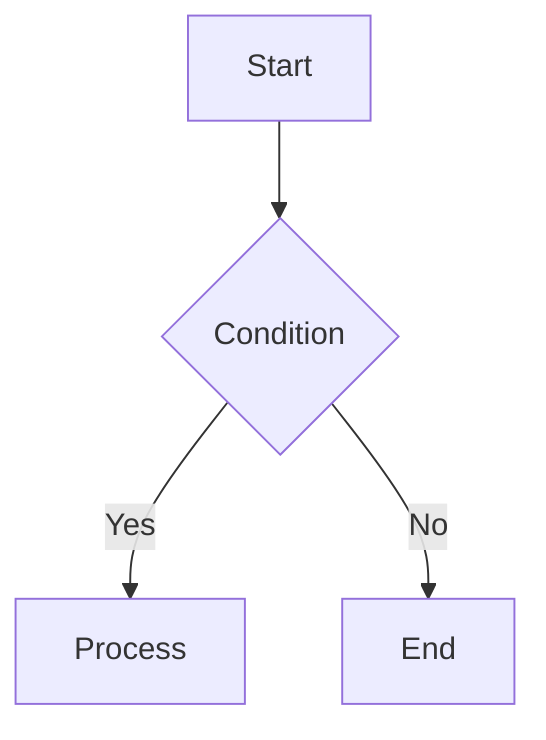

# Ageha Editor


To install, please select the version appropriate for your platform from [Release](https://github.com/itsuki-maru/Ageha-Editor/releases/tag/v0.3.0). Note that on Windows, you can also download and run `ageha.exe`, but depending on your OS version, components such as WebView may be missing. In that case, please use the installer.

In some cases, the following warning may be issued:

> The author accepts absolutely no responsibility for any damage caused by using this application.
>
> This application is recommended only for those who are not intimidated by blue windows like the one below.
>
> 
>
> Despite kindly providing a `.dmg` release, the author also says, "I've only ever touched a MacBook at Yodobashi Camera," and "It ran on Linux, so it should be fine."

## Overview

**Ageha Editor** is a Markdown editor built with [Tauri](https://v2.tauri.app/). It is lightweight and can be used without a heavyweight runtime installation.

**Default Screen Image**


**Full Screen Image**


### Core Features

- Real-time preview
- Printing, including PDF output
- HTML export
- Writing assistance tools
- Mermaid diagram support
- KaTeX math support
- Slide authoring with Marp
- Slideshow mode
- Vim mode
- Custom CSS
- Japanese / English UI switching

---

## Features

### Editor

- Full-featured text editor based on [Ace Editor](https://ace.c9.io/)
- **Vim mode**: switch to Vim key bindings with `Ctrl+,` or the toolbar toggle
- **Scroll sync**: keeps the editor and preview positions aligned
- **Unsaved state tracking**: shows `*` in the title bar when the document is dirty

### File Operations

| Action        | Description                                 |
| ------------- | ------------------------------------------- |
| Open file     | Select and load a file from a dialog        |
| Save file     | Save the current content to a local file    |
| Drag and drop | Drop a file into the editor area to open it |
| New window    | Launch a new editor window                  |

Supported file types: `.md` `.txt`

### Output

- **Print / PDF output**: use the browser print dialog to produce PDF output
- **HTML export**: export a single-file HTML document with CSS, images, and fonts inlined
- **Separate viewer window**: open the preview in an independent window

### Extended Markdown Syntax

In addition to standard Markdown, Ageha supports the following custom syntax:

| Syntax                   | Description              |
| ------------------------ | ------------------------ |
| `?[alt](video.mp4)`      | Embed a video            |
| `@[youtube](URL)`        | Embed YouTube            |
| `:::details Title...:::` | Collapsible block        |
| `:::note Title...:::`    | Note block               |
| `:::warning Title...:::` | Warning block            |
| `@@@`                    | Page break when printing |

### Slide Mode


If the frontmatter contains `marp: true`, the document automatically switches to slide mode.

```markdown
---
marp: true
---

# Slide Title

---

## Second Slide
```

- Automatically applies the `ageha-slide` theme, `16:9` size, and `KaTeX` math mode
- Supports printing, HTML export, and the separate viewer

#### Slideshow (`Ctrl+Alt+S` or the "Play" button)


Available only in slide mode. Opens a presentation window that shows one slide at a time.

| Action                     | Behavior                           |
| -------------------------- | ---------------------------------- |
| `→` / `↓` / `Space`        | Next slide                         |
| `←` / `↑`                  | Previous slide                     |
| `Home` / `End`             | First / last slide                 |
| Click right half of screen | Next slide                         |
| Click left half of screen  | Previous slide                     |
| Hover near bottom          | Show navigation UI (`← counter →`) |

### Mermaid Diagrams

Specify `mermaid` in a fenced code block to render a diagram.

````markdown

````

Supports flowcharts, sequence diagrams, state diagrams, class diagrams, ER diagrams, and more.

> Refresh the preview with `Ctrl + M`

### Math (KaTeX)

Supports both inline math and display math.

```text
Inline: $E = mc^2$

Display:
$$
tax = \frac{price\ with\ tax \times tax\ rate}{tax\ rate + 100}
$$
```

---

## Keyboard Shortcuts

| Key          | Function                          |
| ------------ | --------------------------------- |
| `Ctrl+O`     | Open file                         |
| `Ctrl+S`     | Save file                         |
| `Ctrl+R`     | Insert image                      |
| `Ctrl+M`     | Re-render Mermaid                 |
| `Ctrl+,`     | Toggle Vim mode                   |
| `Ctrl+Alt+P` | Print / PDF output                |
| `Ctrl+Alt+F` | Export HTML                       |
| `Ctrl+Alt+W` | Open preview in a separate window |
| `Ctrl+Alt+/` | Toggle preview visibility         |
| `Ctrl+Alt+I` | Toggle writing tools panel        |
| `Ctrl+Alt+H` | Show help                         |
| `Ctrl+Alt+N` | Open a new window                 |
| `Ctrl+Alt+S` | Open slideshow                    |
| `Escape`     | Close modal dialogs               |

---

## Custom CSS

On first launch, the application creates `~/.ageha/` in the user directory.

| File                       | Description                     |
| -------------------------- | ------------------------------- |
| `~/.ageha/ageha.css`       | Styles for the Markdown preview |
| `~/.ageha/ageha-slide.css` | Styles for slide preview        |

By editing these files, you can customize the styling used in preview, printing, and HTML export.

---

## Language Support

- The application UI supports both Japanese and English.
- Use the language button in the top-right toolbar area to switch languages.
- The selected language is saved locally and restored on the next launch.
- Help content, tooltips, dialogs, viewer output, and print overlay messages also follow the selected language.

---

## Development

### Requirements

- Node.js 18+
- Rust 1.70+
- Tauri CLI v2

### Setup and Run

```bash
npm install
npm run tauri dev
```

### Build

```bash
npm run build
npm run tauri build
```

### Release

Releases are handled by the GitHub Actions workflow `release.yml`. It automatically builds installers for Linux, macOS (Universal), and Windows, then uploads them to GitHub as a draft release.

#### Test Procedure Before a Production Release

Push a temporary tag to confirm that the workflow completes successfully.

```bash
# 1. Create a branch for release workflow testing
git checkout -b test/release-workflow

# 2. Push a temporary tag (this triggers the workflow)
git tag v0.0.0-test
git push origin v0.0.0-test
```

Check progress in the **Actions** tab on GitHub. If you use the `gh` CLI:

```bash
gh run list --workflow=release.yml
gh run watch
```

After verification, delete the temporary tag and clean up the draft release.

```bash
# Delete the local and remote tags
git tag -d v0.0.0-test
git push origin --delete v0.0.0-test
```

Also delete the draft release from the GitHub UI under **Releases → Draft → Delete**.

#### Production Release Procedure

```bash
# 1. Update the version (package.json / src-tauri/Cargo.toml / src-tauri/tauri.conf.json)

# 2. Commit
git add package.json src-tauri/Cargo.toml src-tauri/tauri.conf.json
git commit -m "Prepare for release vX.Y.Z"

# 3. Tag and push (this triggers the workflow)
git tag vX.Y.Z
git push origin main --tags
```

After the workflow finishes, a draft release will appear in **Releases** on GitHub. Review it and click **Publish release**.

---

## License

MIT
